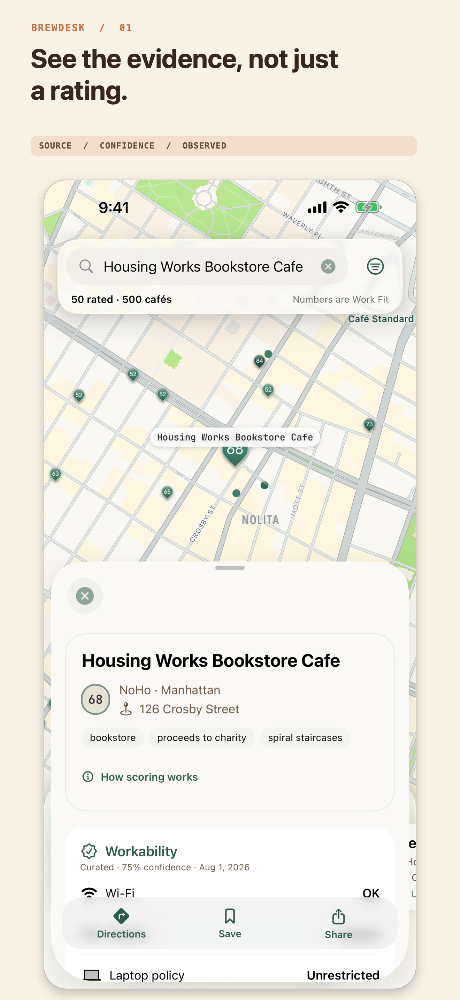
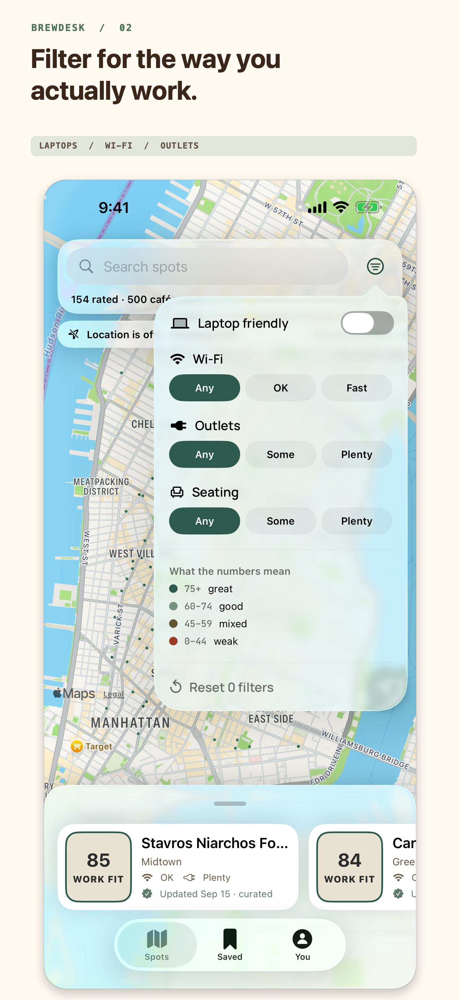
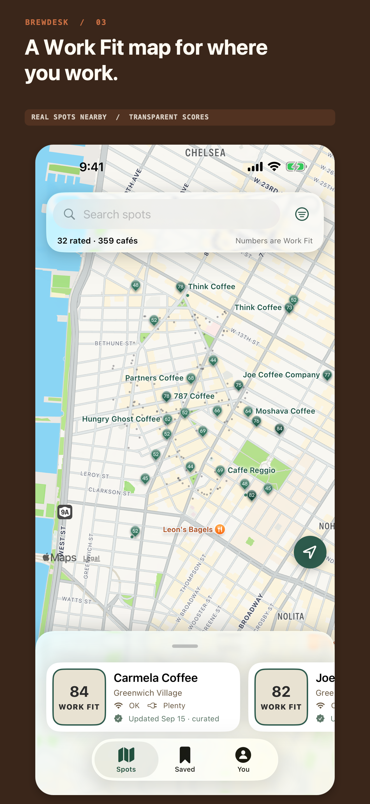
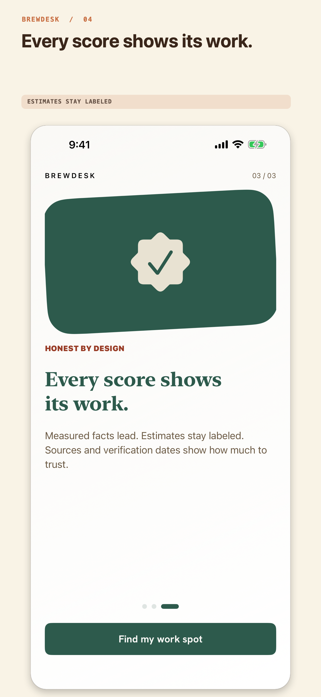
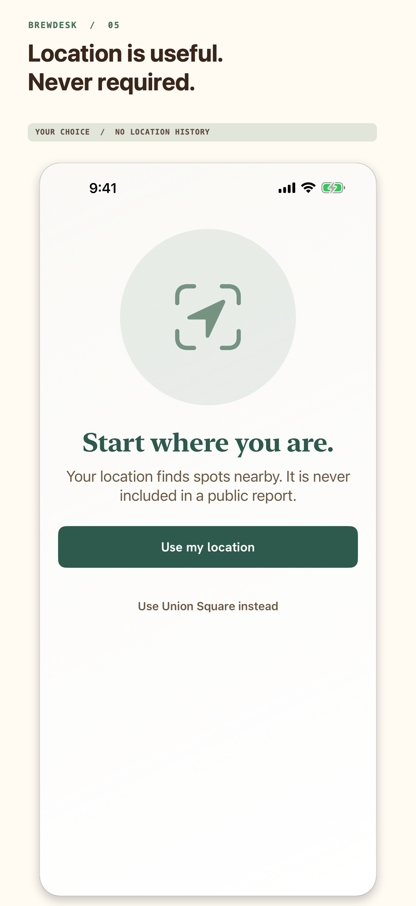
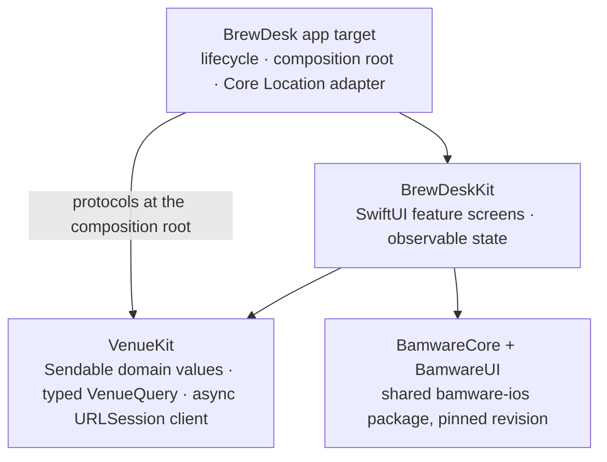

# BrewDesk

**A Swift 6 app built to survive App Review.**

After Apple rejected my last app under Guideline 4.3(b) — design spam — I
decided the next one would make its differentiator visible in the binary
itself, not in a marketing paragraph a reviewer never reads. That rejection
story lives in [Baat](https://github.com/mrbam88/baat-rn); BrewDesk is what I
built with the lesson. It is a native SwiftUI app from Bamware, the studio I
run, and this README explains its architecture: strict Swift 6 concurrency, a
data-driven product where the server owns facts and the client owns
presentation, and evidence as an architectural choice rather than UI polish.

## What BrewDesk is

BrewDesk finds places to work from in New York City. It is not a café list:
venues are ranked by **Work Fit**, which weighs laptop policy above seating,
seating above Wi-Fi, and Wi-Fi above noise — the order in which those things
actually ruin a work session.

The part I care most about: every claim in the app shows its work. Wi-Fi,
outlets, laptop policy, and noise each carry a source, a confidence value, and
an observation date, rendered as "updated \<date\> · \<source\>" next to the
claim itself. An estimate says it is an estimate. The app also ships a
methodology screen
([`Packages/BrewDeskKit/Sources/BrewDeskKit/MethodologyScreen.swift`](Packages/BrewDeskKit/Sources/BrewDeskKit/MethodologyScreen.swift))
explaining how scores are built — and a UI test proves it stays reachable even
when the backend is down.

<p align="center">
  
  
  
  
  
</p>

V1 is deliberately small: free accountless discovery, optional location with a
Union Square fallback, map/list/search with work-specific filters, locally
saved cafés, Apple Maps directions, English and Spanish. No accounts, no
subscriptions, no analytics, no tracking.

## Product architecture

BrewDesk is intentionally data-driven. The
[Venue Engine](https://github.com/mrbam88/bamware-venue-engine) owns venue
facts, provenance, confidence, filtering, and ranking. The iOS app owns native
interaction, accessibility, presentation, and local preferences.

The rule that keeps this split honest: **the API returns semantic facts, not
layout.** A claim arrives as
`{ value, source, confidence, observedAt }` — see `Claim` in
[`Packages/BrewDeskKit/Sources/VenueKit/Models.swift`](Packages/BrewDeskKit/Sources/VenueKit/Models.swift)
— and the client decides how to render it. Transport values like `speed_test`
stay stable on the wire; the client maps them to localized display labels.

This is why scoring can improve without an App Store release: reweight Work
Fit server-side and every installed client shows the new ranking, while the
native app remains a real app rather than a web view wearing a frame. The full
rationale is in [docs/ARCHITECTURE.md](docs/ARCHITECTURE.md).

## Code architecture

Three layers, one direction:



The rules ([docs/ARCHITECTURE.md](docs/ARCHITECTURE.md)): `VenueKit` never
imports SwiftUI or a consumer app; feature UI never resolves global
dependencies; the app target constructs concrete dependencies and passes
capabilities in; shared `bamware-ios` products never import BrewDesk.

The API surface is split by what a consumer needs — interface segregation, not
a generic repository framework. From
[`Packages/BrewDeskKit/Sources/VenueKit/VenueAPI.swift`](Packages/BrewDeskKit/Sources/VenueKit/VenueAPI.swift):

```swift
public protocol VenueListing: Sendable {
    func fetchVenues(_ query: VenueQuery) async throws -> [Venue]
    /// Dataset-level stats for the stat strip. Optional capability: the
    /// default returns nil and the UI renders nothing.
    func fetchHealth() async throws -> HealthResponse?
}
```

`VenueDetailServing`, `VenuePhotoServing`, and `VenueMeasuring` are the same
idea at different scopes. Discovery tests never implement speed-test methods;
Saved never depends on the whole client.

Injection is constructor injection at the app edge — no service locator, no
property-wrapper DI framework. From
[`BrewDesk/RootView.swift`](BrewDesk/RootView.swift):

```swift
init(
    venueListing: any VenueListing = VenueAPI(),
    venueDetails: any VenueDetailServing = VenueAPI()
)
```

`RootView` builds the concrete `VenueAPI`;
[`BrewDesk/Flow/DiscoveryRootView.swift`](BrewDesk/Flow/DiscoveryRootView.swift)
owns one shared `VenuesModel` so Explore and Nearby stay in sync. Under a UI
test launch argument, the same seams accept
[`ScenarioVenueService`](Packages/BrewDeskKit/Sources/VenueKit/ScenarioVenueService.swift)
instead — more on that below.

## Swift 6 concurrency

The package opts into strict, approachable concurrency:
[`Packages/BrewDeskKit/Package.swift`](Packages/BrewDeskKit/Package.swift)
sets `.defaultIsolation(MainActor.self)` for the UI layer and
`NonisolatedNonsendingByDefault` throughout, on Swift tools 6.2. The division
of labor is simple: UI state is `@MainActor` and `@Observable`; domain and API
values are immutable and `Sendable`; there are no detached tasks and no
unchecked-`Sendable` escapes.

Loading is structured and cancellable. Filter, search, and location changes
alter a `VenueLoadRequest`; SwiftUI's `.task(id:)` cancels the previous load
when that identity changes; and a generation counter rejects stale completions
even if some future API implementation ignores cancellation. From
[`Packages/BrewDeskKit/Sources/BrewDeskKit/VenuesModel.swift`](Packages/BrewDeskKit/Sources/BrewDeskKit/VenuesModel.swift):

```swift
public func load(_ request: VenueLoadRequest) async {
    loadGeneration += 1
    let generation = loadGeneration
    phase = .loading
    // Cold start: until the engine has answered once, paint the bundled
    // snapshot instead of a spinner. Never re-seed after a live answer —
    // an empty filter result must stay empty, not flash the snapshot.
    if !hasReceivedLiveVenues, venues.isEmpty, !snapshot.isEmpty {
        venues = snapshot
        isShowingSnapshot = true
    }
    do {
        let loadedVenues = try await api.fetchVenues(request.query)
        try Task.checkCancellation()
        guard generation == loadGeneration else { return }
        venues = loadedVenues
        hasReceivedLiveVenues = true
        isShowingSnapshot = false
        phase = .loaded
    } catch is CancellationError {
        guard generation == loadGeneration else { return }
        phase = (venues.isEmpty || isShowingSnapshot) ? .idle : .loaded
    } catch {
        guard generation == loadGeneration else { return }
        phase = .failed(error.localizedDescription)
    }
}
```

That bundled snapshot
([`Packages/BrewDeskKit/Sources/VenueKit/VenueSnapshot.swift`](Packages/BrewDeskKit/Sources/VenueKit/VenueSnapshot.swift))
is a build-time slice of real engine data, so a fresh install paints real
venues before — or without — the first network round-trip. Core Location is
async too: [`BrewDesk/Location/LocationService.swift`](BrewDesk/Location/LocationService.swift)
consumes `CLLocationUpdate.liveUpdates()` as an `AsyncSequence` inside a task
it owns and cancels. Requests fail fast — `VenueAPI` uses a 15-second timeout
so a stalled engine becomes an explicit Retry state, not a hanging spinner.

## Native polish as a feature

If the differentiator has to be visible in the binary, the binary has to feel
like it belongs on the platform.

- **Liquid Glass with a fallback.** iOS 26 gets Liquid Glass as progressive
  enhancement; iOS 17 gets system materials through the same view modifier
  ([docs/ARCHITECTURE.md](docs/ARCHITECTURE.md), styling in
  [`Packages/BrewDeskKit/Sources/BrewDeskKit/BrewDeskStyle.swift`](Packages/BrewDeskKit/Sources/BrewDeskKit/BrewDeskStyle.swift)).
- **Accessibility as tested behavior.** Semantic Dynamic Type, layouts that
  survive accessibility text sizes, 44-point targets, VoiceOver labels and
  selected state, state communicated by more than color, Reduce Motion. UI
  tests run `performAccessibilityAudit()` on onboarding and venue detail
  ([`BrewDeskUITests/BrewDeskUITests.swift`](BrewDeskUITests/BrewDeskUITests.swift)).
- **Localization as architecture.** English and Spanish live in
  [`BrewDesk/Localizable.xcstrings`](BrewDesk/Localizable.xcstrings) and
  [`BrewDesk/InfoPlist.xcstrings`](BrewDesk/InfoPlist.xcstrings); backend enum
  values stay stable wire values and are localized only at display time. A UI
  test navigates the app in Spanish.
- **Privacy that is verified, not asserted.** The app declares
  [`BrewDesk/PrivacyInfo.xcprivacy`](BrewDesk/PrivacyInfo.xcprivacy), and
  [`BrewDeskTests/PrivacyClaimTests.swift`](BrewDeskTests/PrivacyClaimTests.swift)
  runs against the Release bundle in CI to check the manifest, ATS policy, and
  production endpoint that actually ship.

## Testing and release

Tests are evidence with different scopes; each layer proves what a cheaper
layer cannot ([docs/TESTING.md](docs/TESTING.md)).

**Package tests** ([`Packages/BrewDeskKit/Tests/`](Packages/BrewDeskKit/Tests/))
prove model decoding, typed filters, latest-request-wins loading, snapshot
fallback, and Saved persistence in Swift Testing.

**Degraded states are the suite, not an afterthought.**
[`BrewDeskUITests/DegradedStateTests.swift`](BrewDeskUITests/DegradedStateTests.swift)
holds 22 tests pinning every screen under engine 500, offline, empty results,
photo failures, slow network, and denied location — including cold-start
offline rendering snapshot rows with Retry within two seconds, and recovery
without relaunch. They run against `ScenarioVenueService`, a deterministic
in-process stand-in with eight named scenarios (`engineDown`, `offline`,
`slow`, `offlineThenRecovers`, …) selected by a launch argument. The seam is a
single argument lookup with no UI entry point and no network, and it compiles
in Release because the release gate runs UI tests in Release.

**Reviewer simulation.**
[`BrewDeskUITests/ReviewerSimulationTests.swift`](BrewDeskUITests/ReviewerSimulationTests.swift)
replays a reviewer's first ten minutes as one scripted Release run, capturing
a screenshot per step as evidence ([docs/REVIEWER-SIMULATION.md](docs/REVIEWER-SIMULATION.md)).
[`reviewer-sim.yml`](.github/workflows/reviewer-sim.yml) runs it on every push
to main and nightly, on iPhone and in iPad compatibility, and uploads the
xcresult bundles and screenshots as a downloadable archive.

**Screenshots are code.**
[`BrewDeskUITests/AppStoreScreenshotTests.swift`](BrewDeskUITests/AppStoreScreenshotTests.swift)
captures the store screens deterministically in English and Spanish;
[`scripts/compose_app_store_screenshots.swift`](scripts/compose_app_store_screenshots.swift)
composes the framed 1320×2868 output in
[`fastlane/screenshots/`](fastlane/screenshots/). The images above are the
actual store assets, regenerated by rerunning the pipeline.

**CI and the release rail.** [`ci.yml`](.github/workflows/ci.yml) runs package
tests, the Release privacy suite, and a workspace build against a sibling
`bamware-ios` checkout. [`identity.yml`](.github/workflows/identity.yml)
rejects legacy product names on every push, so the canonical `BrewDesk` /
`io.bamware.brewdesk` identity cannot drift. Release goes through the fastlane
`ship_testflight` lane ([`fastlane/Fastfile`](fastlane/Fastfile)) to
TestFlight; [docs/RELEASING.md](docs/RELEASING.md) documents each gate,
because a successful upload is not a processed build, and a processed build is
not a physical smoke test.

## What the shared package gives you

[`bamware-ios`](https://github.com/mrbam88/bamware-ios) is the public package
behind `BamwareCore` and `BamwareUI`, pinned by revision in
[`Packages/BrewDeskKit/Package.swift`](Packages/BrewDeskKit/Package.swift).
Keeping a shared package as a solo developer is a forcing function more than a
convenience: it keeps app-agnostic code honestly app-agnostic, gives every new
app a tested floor of primitives instead of a copy-paste inheritance, and
makes boundary violations loud — a shared product that wants to import
BrewDesk is a design error caught at the manifest. The
`BrewDeskDevelopment.xcworkspace` substitutes a sibling checkout for local
development while the committed pin keeps standalone and CI builds
reproducible.

## Running it

Requires Xcode 26 with Swift 6.2. Debug builds expect a local
[Venue Engine](https://github.com/mrbam88/bamware-venue-engine) at
`http://localhost:3000` (`npm run dev` in a sibling checkout), or launch with
`-UITestScenario fixtureOK` to run on bundled fixtures with no backend at all.

```bash
open BrewDesk.xcodeproj   # scheme: BrewDesk, any iPhone simulator
```

Release builds point at the deployed HTTPS engine automatically; see
[docs/ARCHITECTURE.md](docs/ARCHITECTURE.md#configuration).

## License and author

Copyright © 2026 Bilal Malik. The source is available to read and evaluate; no
license is granted for reuse.

I'm Bilal — I build native and cross-platform apps at Bamware, the studio I
run. BrewDesk is one app in that portfolio, alongside the
[Venue Engine](https://github.com/mrbam88/bamware-venue-engine) that feeds it
and the [shared iOS packages](https://github.com/mrbam88/bamware-ios) that
floor it. Issues and questions welcome.
