# UI Enhancement Review — 2026-08-21 (issue #55)

Skills-driven design pass over every screen. Reviewed live on the iPhone 17 simulator
(iOS 26.4, production API, light + dark, Dynamic Type accessibility sizes, degraded states
via `-UITestScenario`). Skills applied and cited per finding:

- **ui-ux-pro-max** — priority rules, `references/pro-rules.md` (icon discipline, token theming, contrast, insets), UX guideline DB hits
- **mobile-ios-design** — HIG clarity/deference, semantic colors, SF Symbols, Dynamic Type
- **swiftui-pro** — `references/design.md` (shared design constants, fixed frames, `.caption2`, UIKit colors)
- **ios-accessibility** — Dynamic Type scaling, contrast, color-only meaning, VoiceOver labels

Screenshots: [`ui-review-assets/`](ui-review-assets/). Priorities: **P0** ship-blocker polish ·
**P1** strong improvement · **P2** nice.

What is already good (keep): every screen has loading/empty/error states with stable
accessibility identifiers; map pins and cards carry full VoiceOver labels; `reduceMotion`
is respected; `brewDeskGlass` wraps Liquid Glass with an iOS <26 fallback;
`ContentUnavailableView` is used for empty/error per HIG; provenance transparency
(source · confidence · date) is a genuine differentiator.

---

## P0 — ship-blocker polish

### 1. Map pins: identical coffee glyph on every annotation, heavy overlap

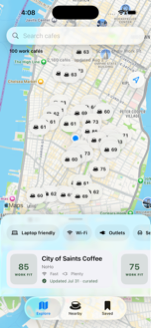

- **Flaw:** All ~40 rendered pins repeat the same `cup.and.saucer.fill` glyph, which adds zero information on a map where everything is a cafe, and overlapping capsules clip each other until scores read as meaningless digit fragments ("3", "1", "4").
- **Violates:** ui-ux-pro-max `pro-rules.md` "Contextual Semantics" (decorative glyphs must not masquerade as information) and priority 4 anti-pattern (icon inconsistency/noise); mobile-ios-design HIG *Deference* — UI must not compete with content (the map IS the content).
- **Fix:** Replace with **zoom-dependent clustered score pills** — the proposal below feeds #54, whose AC already states "fewer, smarter pins IS the perf fix".
- **Priority: P0** (`CafeMapScreen.swift:23-49`)

**Proposed map direction (feeds #54):**

| Zoom | Rendering |
|---|---|
| Far (borough) | Cluster pills: count + best score, e.g. `12 · top 85`, tier-tinted; tap zooms in |
| Mid (neighborhood) | Top-N venues by Work Fit get score-only pills; the rest collapse to 8pt tier-colored dots |
| Near (blocks) | Score-only pills for all; top scores may add a name callout |
| Selected | Pill expands to name + score, tier color fill (existing behavior, keep) |

Score pill = number only, monospaced bold, tier-tinted stroke or leading dot on
`.regularMaterial` — no glyph. The existing VoiceOver label format
("name, Work Fit n, neighborhood") is load-bearing for UI tests and must survive.

### 2. Map header text floats over the map with no surface — unreadable, invisible in dark mode

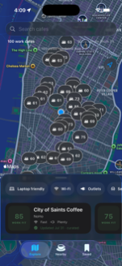

- **Flaw:** "100 work cafés", "Scores show Work Fit", and the dataset strip ("2,180 cafés · updated Aug 2") are bare text painted straight onto the map, colliding with Apple Maps labels in light mode (see also `05b`, `18`) and disappearing entirely dark-on-dark in dark mode.
- **Violates:** ui-ux-pro-max UX DB "Accessibility / Color Contrast" (4.5:1 minimum — High severity) and `pro-rules.md` "Scrim and modal legibility" (measure the composed result); ios-accessibility core principle 4 (text must adapt to contrast contexts).
- **Fix:** Move the count, hint, stat strip, and banners into one `brewDeskGlass` surface with the search field (a single glass header card), or give each line a material capsule as `coverage-banner` already does. Verify both themes.
- **Priority: P0** (`CafeMapScreen.swift:103-156`)

### 3. Brand fractures between tabs: Explore is BrewDesk, everything else is a stock template

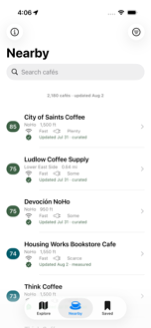 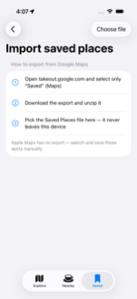

- **Flaw:** Onboarding and Explore speak the brand (cream `pageGradient`, serif display, espresso/roast); Nearby, Saved, Import, Methodology, and the detail cards are stock system white/gray with **default system-blue** links, buttons, step numerals, and tab tint — two different apps in one binary.
- **Violates:** ui-ux-pro-max `pro-rules.md` "Token-driven theming" (no ad-hoc per-screen colors); swiftui-pro `design.md` (shared design constants; avoid `Color(uiColor:)` — found at `CafeMapScreen.swift:321`, `VenueDetailScreen.swift:459`, `MethodologyScreen.swift:42,57`); mobile-ios-design "Use Semantic Colors" — the root cause is the **empty `AccentColor` asset**, so UIKit-derived chrome falls back to blue.
- **Fix:** (1) Set `AccentColor` to roast/espresso (light+dark variants); (2) add semantic surface tokens to `BrewDeskPalette` (`surface`, `surfaceSecondary`, `page`) with dark variants and replace every `Color(uiColor:)`; (3) apply the cream page treatment to Nearby/Saved/Import/Methodology backgrounds.
- **Priority: P0** (`BrewDeskStyle.swift`, `Assets.xcassets/AccentColor`)

---

## P1 — strong improvements

### 4. One glyph, three meanings: `cup.and.saucer.fill` is the Nearby tab, the map pin, and the empty-state icon

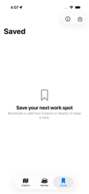

- **Flaw:** The same cup glyph identifies the Nearby *tab*, every map *pin*, and the "no cafes" *empty state* — an icon that means everything identifies nothing.
- **Violates:** ui-ux-pro-max `pro-rules.md` "Contextual Semantics" ("the same glyph can serve different purposes" is to be *managed*, not accumulated); mobile-ios-design "Embrace SF Symbols" (symbols must aid recognition).
- **Fix:** Nearby tab → `list.bullet` (it is a list); keep the cup exclusively for cafe-venue-type semantics (type filter chips, empty states). With finding 1, the cup disappears from pins entirely.
- **Priority: P1** (`DiscoveryRootView.swift:40`)

### 5. Saved empty state has no action

- **Flaw:** "Save your next work spot" tells the user to go bookmark a cafe but offers no button to get there.
- **Violates:** ui-ux-pro-max UX DB "Feedback / Empty States" — *Do: show helpful message **and action*** (Medium severity).
- **Fix:** Add a "Browse Nearby" button (needs a `TabView` selection binding to switch tabs — `DiscoveryRootView` currently has none).
- **Priority: P1** (`SavedCafesScreen.swift:90`, `DiscoveryRootView.swift:35`)

### 6. Detail action dock overlaps the photo strip at medium detent

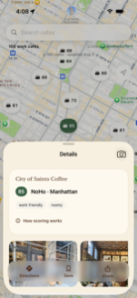

- **Flaw:** The Directions/Save/Share glass dock floats on top of the photo carousel, hiding the middle third of the photos.
- **Violates:** ui-ux-pro-max `pro-rules.md` "Scroll and fixed element coexistence" (content must not hide behind fixed bars).
- **Fix:** The dock is a `safeAreaInset(edge: .bottom)` (`VenueDetailScreen.swift:44`) but the scroll content lacks matching bottom margin at medium detent — add `contentMargins(.bottom, dockHeight)` / spacer so the strip clears it.
- **Priority: P1**

### 7. Dynamic Type: fixed frames and a fixed 8pt label break at accessibility sizes

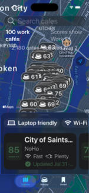

- **Flaw:** At accessibility text sizes the shelf card truncates name and provenance, the second card clips to "7 WOR", and "WORK FIT" is a hard-coded 8pt that never scales.
- **Violates:** swiftui-pro `design.md` ("avoid fixed frames"; `.caption2` "extremely small, best avoided" — 8pt is beneath even that; found `CafeMapScreen.swift:296` `.font(.system(size: 8))`, fixed `frame(width: 72, height: 82)` at `:301`); ios-accessibility Dynamic Type (use text styles + `@ScaledMetric`); ui-ux-pro-max UX DB "Text Reflow and Spacing" (Critical — never clip text in fixed boxes).
- **Fix:** `@ScaledMetric(relativeTo:)` for card dimensions, replace 8pt with `.caption2.smallCaps()` or drop the caption (the tier color + number already say it), let cards reflow vertically at accessibility sizes.
- **Priority: P1**

### 8. Provenance copy leaks machine format: "Curated · 75% confidence · 2026-08-01"

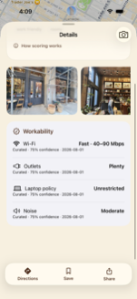

- **Flaw:** Detail claim rows print a raw ISO date and stats jargon while every other surface humanizes the same fact as "Updated Jul 31 · curated".
- **Violates:** mobile-ios-design HIG *Clarity*; ui-ux-pro-max consistency principle (one fact, one format).
- **Fix:** One shared provenance formatter: "Curated · Aug 1"; keep the confidence number for the Methodology page (it is already explained there).
- **Priority: P1** (`VenueDetailScreen.swift` claim rows)

### 9. Score tier color is invisible until you tap

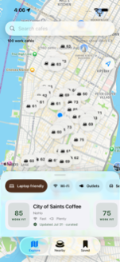

- **Flaw:** At rest every pin is the same neutral material — the moss/ocean/clay/berry tier ramp (the app's core signal) only appears after selection, so the map ranks nothing at a glance.
- **Violates:** mobile-ios-design HIG *Clarity* (visual hierarchy should express meaning); ios-accessibility note: color must not be the *only* channel — pair tint with the number, which is already present.
- **Fix:** Tier-tinted stroke or leading dot on unselected pills (fill stays material for map legibility); selected keeps full tier fill. Slots directly into the finding-1 pill redesign.
- **Priority: P1** (`CafeMapScreen.swift:34-42`, `Components.swift` ScoreTier)

### 10. Two filter paradigms, and the list menu is a 9-item wall without labels or reset

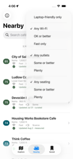

- **Flaw:** The map filters by chips, the list by a stock toolbar `Menu` whose three unlabeled groups ("Any Wi-Fi / OK or better / Fast only"…) force the user to infer each group's dimension, with no "Reset all".
- **Violates:** ui-ux-pro-max priority 9 (predictable navigation patterns / consistency); mobile-ios-design HIG *Clarity*.
- **Fix:** One shared filter surface for both tabs — the map's chip row is the better pattern; if the menu stays, add `Section("Wi-Fi")`-style headers and a Reset row, and show active-filter count on the toolbar icon (it already tints).
- **Priority: P1** (`CafeListScreen.swift:150`, `CafeMapScreen.swift:165-208`)

---

## P2 — nice

### 11. Onboarding heroes spend ~45% of the viewport on one flat glyph

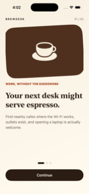 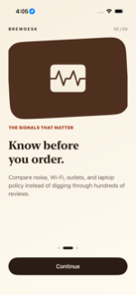

- **Flaw:** Each page's brown block holds a single static icon while a third of the page below the body sits empty — high cost, low information, and page 2's waveform glyph is generic.
- **Violates:** ui-ux-pro-max priority table (hierarchy: strongest visual weight on the least informative element); frontend-design intent (avoid templated look).
- **Fix:** Shrink the hero band, preview the actual product inside it (mini map with clustered score pills — reinforces finding 1's language), pull content up so the dots don't float in a void.
- **Priority: P2** (`OnboardingView.swift`)

### 12. Search placeholder copy diverges: "Search cafes" (map) vs "Search cafés" (list)

- **Flaw:** Same action, two spellings, visible within one tab switch (`05b` vs `10-list-nearby`); the app's standard elsewhere is "cafés".
- **Violates:** mobile-ios-design HIG *Clarity* / copy consistency.
- **Fix:** One localized string, reused. (`CafeMapScreen.swift:108`, `CafeListScreen.swift` searchable prompt)
- **Priority: P2**

### 13. Engine-down error paints a full blank wall and hides the map

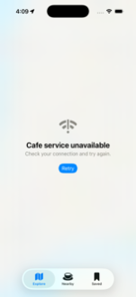

- **Flaw:** `map-state-error` covers map, search, and header with flat material — more punitive than the failure warrants — and its Retry button is off-brand system blue (see finding 3).
- **Violates:** mobile-ios-design HIG *Deference*; ui-ux-pro-max feedback guidance (degrade, don't obliterate).
- **Fix:** Dim the map behind a centered error card instead of a full-screen fill; style Retry with `PrimaryActionStyle`. Note the snapshot-banner path (`snapshot-banner-offline`) already degrades gracefully — align the no-data path with it.
- **Priority: P2** (`CafeMapScreen.swift:84-97`)

### 14. Spacing and type are untokenized inline literals

- **Flaw:** Paddings 4/8/10/12/14/16/18/20/24/26 and per-call-site fonts are scattered inline across screens (no shared scale), which is how findings 3, 7, 12 crept in.
- **Violates:** swiftui-pro `design.md` ("place standard fonts, sizes, colors, spacing into a shared enum"); ui-ux-pro-max `pro-rules.md` "8dp spacing rhythm" + "Section spacing hierarchy".
- **Fix:** `BrewDeskSpacing` (4/8/12/16/24/32) + type roles in `BrewDeskStyle.swift`; mechanical sweep.
- **Priority: P2**

### 15. Location-denied banner floats detached mid-map

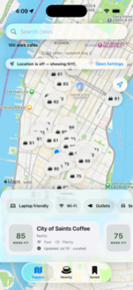

- **Flaw:** "Location is off — showing NYC" renders as an island between the (surface-less) header text and the pins instead of docking with the header stack.
- **Violates:** ui-ux-pro-max `pro-rules.md` "Fixed Positioning" (stacked fixed elements need deliberate grouping).
- **Fix:** Solved by finding 2's single glass header card — banners become rows of that card.
- **Priority: P2** (`Components.swift:226`)

---

## Do these first (top 5)

1. **Kill the cup glyph on map pins** — score-only, tier-tinted, zoom-dependent clustered pills per the table in finding 1; coordinate with #54, which implements the mechanics (findings 1 + 9).
2. **Give the map header a real surface** — one glass card for search + count + stat strip + banners; fixes light-mode collisions, dark-mode invisibility, and the floating banner (findings 2 + 15).
3. **Unify the brand across tabs** — set `AccentColor`, add semantic surface tokens, replace `Color(uiColor:)`, cream surfaces on Nearby/Saved/Import/Methodology (finding 3).
4. **De-overlap the detail dock** and fix Dynamic Type truncation on the shelf cards (findings 6 + 7).
5. **One glyph, one meaning + actionable empty states** — new Nearby tab icon, CTA on Saved empty state, labeled filter groups (findings 4 + 5 + 10).

Screens captured: onboarding ×3, location primer, map (light/dark/Dynamic Type/chip-selected/empty/error/denied), detail (medium/large/scrolled), nearby list, filter menu, methodology, saved, import, about. Review only — no code changes in this PR.
