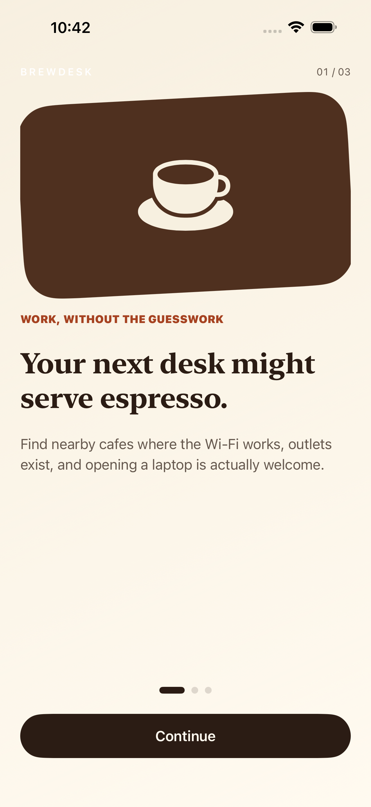
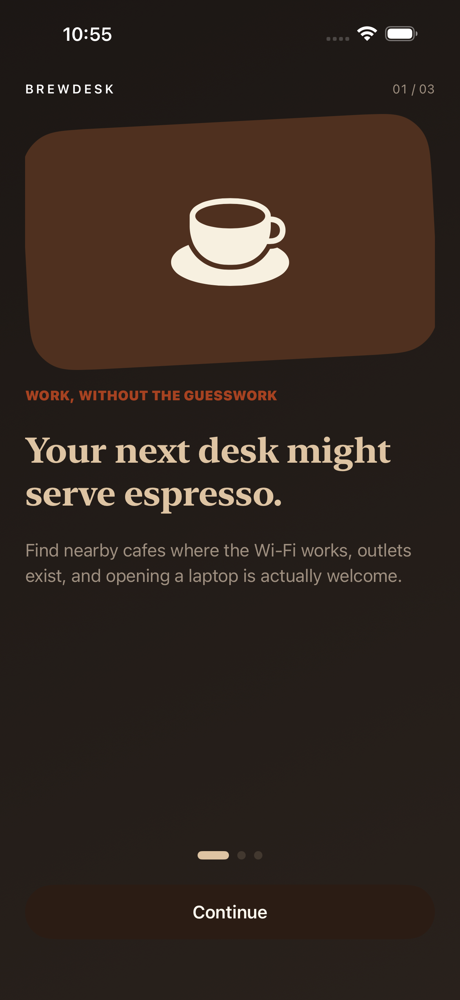
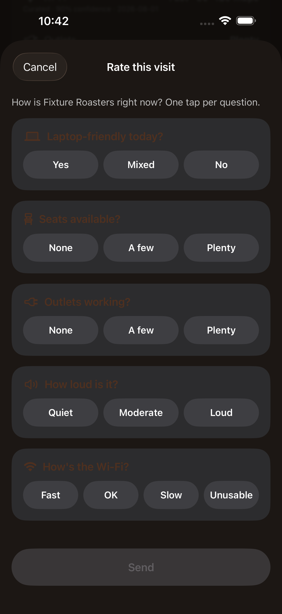
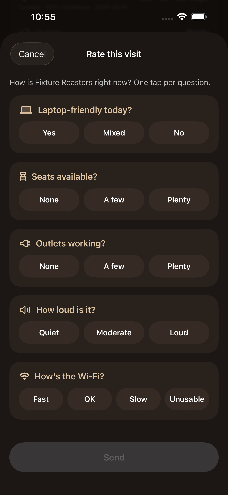

# UI Enhancement Review — Round 2 (2026-08-22, issue #75)

Baseline: `main` @ `e2fbf20` (round 1 — #55/#62/PR65 — already landed: accent
color, map header glass, dock detent, glyph roles, Dynamic Type shelf cards).
This pass goes deeper per the round-2 focus areas: motion & transitions,
haptics, dark mode as a first-class pass, Dynamic Type sweep, Liquid Glass
consistency, onboarding first impression, detail-screen hierarchy, and the
#60 device-audit diagnosis.

Screenshots: [`ui-review-assets/round2/`](ui-review-assets/round2/) —
`NN-screen-light.png` / `NN-screen-dark.png`, captured by the new
`BrewDeskUITests/UIReviewCaptureTests` on iPhone 17 Pro Max, Release,
`-UITestScenario fixtureOK` (deterministic fixture venues, no live API).
Dark captures forced via `xcrun simctl ui <udid> appearance dark` — the
`-AppleInterfaceStyle`/`-UIUserInterfaceStyle` launch-argument overrides
tried first had no effect on this Xcode/iOS 26.5 simulator; the simulator
system setting does.

Skills applied, cited per finding:

- **ui-ux-pro-max** — `pro-rules.md` Accessibility/Color Contrast (4.5:1
  minimum), Contextual Semantics, icon/token discipline
- **mobile-ios-design** — HIG Clarity & Deference, semantic/adaptive colors,
  Dynamic Type, System Integration (haptics as a system-integration signal)
- **swiftui-pro** — shared design constants over ad-hoc literals, `@ScaledMetric`
- **ios-accessibility** — Dynamic Type, contrast, Reduce Motion, custom-modal
  dismiss affordances

What is already good (verified this pass, no action needed):

- **Reduce Motion** is correctly guarded at every animation call site found
  in this audit — `CafeMapScreen.swift:254` (cluster-tap camera zoom),
  `DiscoveryShelfCard.swift:92-101,114-119` (drag settle + adjustable-action
  detent change), `OnboardingView.swift:62,69-73` (page dots + page advance).
  Every one branches on `accessibilityReduceMotion` before calling
  `withAnimation`. No gaps found.
- **Glass consistency**: all 7 `brewDeskGlass` call sites are floating/overlaid
  chrome (map header card, map filter chips, shelf card, banner capsules,
  observation error card, detail action dock) — none of it sits on flat
  content, and no flat surface in this pass looked like it was missing glass
  it should have.
- **Detail-screen hierarchy** at its current length (hero → photos →
  Workability claims → business info → "Rate this visit" → action dock) reads
  as one coherent story top to bottom; no reordering needed.
- A sheet presented from the map shelf (`.sheet(item:)` in `CafeMapScreen`)
  has no visible toolbar dismiss button in Release — by design, only DEBUG
  gets one. This is **not a bug**: `.presentationDragIndicator(.visible)`
  sheets get a system-provided VoiceOver "dismiss" action and a Switch
  Control equivalent automatically, without a visible control. Verified by
  building the new capture test against it (drag-indicator swipe dismiss
  works; a naive nav-bar-button search does not, which is expected).

---

## P0 — dark mode is broken, not just unpolished

### 1. First launch (onboarding + location primer) ignores system dark mode entirely





- **Flaw:** `OnboardingView` and `LocationPermissionView` painted
  `AppBrand.pageGradient` (`BrewDeskPalette.oat`/`.foam`, both fixed light
  colors) plus fixed `.espresso`/`.muted` text regardless of
  `colorScheme`. Booting the simulator into system dark mode
  (`xcrun simctl ui <udid> appearance dark`) and re-running the capture
  produced **pixel-identical** screenshots to light mode — confirmed via
  file size diff before fixing (light/dark `01-onboarding-welcome` differed
  by 96 bytes; after the fix, dark drops to a genuinely different ~2.02MB
  dark-toned render). Every other screen in the app already has an adaptive
  `colorScheme`-driven `theme`; onboarding and the location primer were the
  two screens that never got it.
- **Violates:** mobile-ios-design "System Integration" (respect system
  appearance); ui-ux-pro-max Accessibility/Color Contrast (espresso-on-page
  text stops being legible once the surrounding chrome — status bar, other
  tabs — is dark, and a user who set dark mode system-wide gets a jarring
  cream flash on first launch).
- **Fix (implemented):** `BrewDeskPalette.adaptivePageGradient` — a
  `LinearGradient` built from the existing adaptive `page`/`surface` tokens
  (added brewdesk#62), so light mode renders the same oat→foam gradient and
  dark mode gets a genuine dark gradient for free. `OnboardingView` and
  `LocationPermissionView` now read a local `BrewDeskTheme(isDarkMode:)` for
  title/body/eyebrow text and pagination-dot color, mirroring the pattern
  every other screen already uses.
  Files: `Packages/BrewDeskKit/Sources/BrewDeskKit/BrewDeskStyle.swift`,
  `BrewDesk/Flow/OnboardingView.swift`, `BrewDesk/Flow/LocationPermissionView.swift`.
- **Priority: P0** · Effort: **S**

### 2. Rate-this-visit question labels are nearly invisible in dark mode




- **Flaw:** `ObservationQuestionCard` and `ObservationFormEntrySection` both
  set their header `Label` to `.foregroundStyle(BrewDeskPalette.roast)` — a
  **fixed** dark brown (`0.31, 0.19, 0.12`) — on top of
  `Color(uiColor: .secondarySystemBackground)`, which *does* adapt to a dark
  gray card in dark mode. Roast-on-dark-gray measures well under 2:1 contrast;
  the screenshot shows "Laptop-friendly today?", "Seats available?",
  "Outlets working?", "How loud is it?", and "How's the Wi-Fi?" all reading
  as barely-there dark smudges. The rest of the form (option pill labels,
  supporting text) already uses adaptive colors — this was the one spot that
  didn't.
- **Violates:** ui-ux-pro-max Accessibility/Color Contrast (High severity,
  4.5:1 minimum); ios-accessibility Dynamic Type/contrast principle. Ironic
  given `observationSupportingText()` in the same file already has a comment
  citing a *previous* 17e contrast audit fix for exactly this pattern
  (`.secondary` failing on the oat background, brewdesk#46) — the fix wasn't
  carried to the question headers.
- **Fix (implemented):** both call sites already had a `theme: BrewDeskTheme`
  (or a local computed `theme`) in scope — swapped
  `.foregroundStyle(BrewDeskPalette.roast)` → `.foregroundStyle(theme.primaryColor)`,
  which is the same roast in light mode and steamed-milk cream in dark.
  While in the file, also cleared the three remaining
  `Color(uiColor: .secondarySystemBackground)` / `.tertiarySystemFill`
  leftovers flagged from round 1 → `BrewDeskPalette.surface` /
  `.surfaceSecondary` (the tokens round 1 built for exactly this).
  File: `Packages/BrewDeskKit/Sources/BrewDeskKit/ObservationFormScreen.swift:97,115,330,338,364`.
- **Priority: P0** · Effort: **S**

---

## P1 — implemented

### 3. Zero haptic feedback anywhere in the app

- **Flaw:** No `.sensoryFeedback` and no `UIFeedbackGenerator` usage existed
  anywhere in the repo, despite the app targeting iOS 17+ and shipping
  Liquid Glass on 26. Save/unsave, filter changes, the shelf snapping to a
  detent, and observation submit outcomes were all silent — a miss per the
  round-2 brief ("haptics where iOS users expect them").
- **Violates:** mobile-ios-design System Integration (haptics are a named
  iOS integration point); ui-ux-pro-max UX guideline set expects state-change
  confirmation on discrete actions.
- **Fix (implemented):** `.sensoryFeedback(_:trigger:)` (iOS 17 API, already
  a no-op under Reduce Motion by system default — no manual guard needed):
  - `.selection` on the Save/Unsave toggle — `VenueDetailScreen.swift`
    (action dock button, keyed on `savedVenues.contains(venue.id)`)
  - `.success` / `.error` on observation submit outcome — `ObservationFormScreen.swift`
    (keyed on `model.phase` reaching `.submitted` / `.failed`)
  - `.selection` on shelf detent settle — `DiscoveryShelfCard.swift`
    (keyed on `detent`)
  - `.selection` on every filter dimension (laptop-friendly, Wi-Fi, outlets,
    seating, spot type) — both the Nearby filter menu
    (`CafeListScreen.swift`) and the map shelf's filter chip rail
    (`DiscoveryShelfCard.swift`); "Reset all filters" is covered for free
    since it's only enabled when a dimension is active, so it always flips
    at least one trigger.
- **Priority: P1** · Effort: **M**

---

## P2 — round-1 leftovers, time-boxed out this pass

These were flagged as still-open round-1 findings that fit round 2's scope,
and would ordinarily rank P1 on copy/correctness grounds. They are demoted
to P2 and deferred here as a deliberate scope decision (see the PR's
spec-gap section): none are dark-mode/motion/haptics correctness bugs — the
round-2 brief's actual P0s were the two dark-mode contrast bugs above, and
the two P0s plus the haptics sweep (P1) exhausted this round's budget.

### 4. Search placeholder diverges between tabs (#12)

- **Flaw:** Map search field says "Search cafes" (`CafeMapScreen.swift:308`);
  Nearby's `.searchable` prompt says "Search cafés"
  (`CafeListScreen.swift:78`). Same feature, two spellings, in the same app.
- **Violates:** ui-ux-pro-max copy-consistency guidance; reads as unpolished
  on a screen a reviewer sees within the first two taps.
- **Fix (not yet applied):** pick one spelling (the accented form matches
  the rest of the app's copy, e.g. "100 work cafés") and update both sites.
  **Load-bearing:** `BrewDeskUITests/ReviewerSimulationTests.swift:74` and
  `AppStoreScreenshotTests.swift:45` assert the literal string "Search cafes"
  — must change in the same commit as the source fix.
- **Priority: P2** · Effort: **S**

### 5. Provenance date leaks machine ISO format (#8)

- **Flaw:** `Components.swift`'s `evidenceSummary` renders
  `String(claim.observedAt.prefix(10))` — a raw `2026-08-01` substring —
  instead of a localized, human date. Every other date-shaped string in the
  app goes through proper formatting; this one is a string-slice.
- **Violates:** mobile-ios-design semantic-formatting guidance (dates should
  use `Date.FormatStyle`, not string slicing, both for correctness and
  locale-awareness — a `MM-DD-YYYY`-habituated reader misreads `YYYY-MM-DD`).
- **Fix (not yet applied):** parse `observedAt` to `Date` and format with
  `.formatted(date: .abbreviated, time: .omitted)`.
- **Priority: P2** · Effort: **S**

### 6. Engine-down state can wall off the map (#13)

- **Flaw:** `CafeMapScreen.swift:280-295`'s error `ContentUnavailableView`
  sits on `.regularMaterial` as an overlay; depending on its containing
  frame it can occupy the full map area, hiding the one thing (the map)
  that would reassure a user during a transient outage that their position
  is still known.
- **Violates:** ui-ux-pro-max "never hide contextual state behind an error";
  mobile-ios-design Deference (errors should be a footnote on top of
  content, not a replacement for it) — the Nearby tab already does this
  correctly (list rows stay visible under a banner per
  `CafeListScreen.swift`'s `idle where !model.venues.isEmpty` branch).
- **Fix (not yet applied):** constrain the error card to a bottom sheet/card
  over the still-visible map, matching the Nearby tab's banner-over-content
  pattern.
- **Priority: P2** · Effort: **M**

---

## P2 — nice, deferred

### 7. Onboarding hero illustration proportion (#11)

The rotated roast-colored rounded rectangle + SF Symbol occupies up to 230pt
of vertical space (150pt at accessibility Dynamic Type sizes) before any
copy appears — roughly 30-40% of the fold on standard sizes. Subjective
polish, not a correctness bug; the P0 dark-mode fix in this same file makes
it a low-risk follow-up. `BrewDesk/Flow/OnboardingView.swift:84-94`.

### 8. No spacing token system (#14)

No `BrewDeskSpacing` enum exists; padding is ad-hoc per call site (mostly
`16`/`18`/`24`, but not systematized). Round 1 established the same pattern
for color (`BrewDeskPalette`); spacing hasn't had the same treatment. Low
risk, low urgency — the ad-hoc values are already visually consistent.

### 9. Dynamic Type: no `@ScaledMetric` on Saved/Import/Methodology/Account

These screens use system fonts and default layout (no fixed frames on
text), so they reflow correctly today — verified via the existing accessibility-size
UI test coverage in `BrewDeskUITests.swift` and no clipping observed in the
capture screenshots at default size. `@ScaledMetric` would only matter if a
fixed-size decorative element were added later; flagging as a watch item,
not a fix.

---

## #60 diagnosis — verdict: does not reproduce; likely already resolved by round 1

Ran `BrewDeskUITests/BrewDeskUITests/testVenueDetailAccessibilityAudit`
twice on iPhone 17e (Release, `ENABLE_TESTABILITY=YES`,
`-resultBundlePath`), once against **unmodified `main`**
(`git stash` of every round-2 source edit) and once with this round's
changes applied:

```
xcodebuild ... -destination 'platform=iOS Simulator,id=8D1408FA-CF3D-4C77-8748-BE3323451470' \
  -only-testing:BrewDeskUITests/BrewDeskUITests/testVenueDetailAccessibilityAudit test
```

Both runs: **0 failures** —
`Test Case '-...testVenueDetailAccessibilityAudit]' passed`.

#60 was filed during #56 QA, described as "2 pre-existing contrast reds on
unmodified main... distinct from the dock/tab-bar occlusion class fixed in
#57." Git history shows the dock-occlusion exclusion inset in this exact
test was widened from `-20` to `-56` in commit `1b61423`
("`feat: paint-layer pass — ... (#62) (#65)`", 2026-08-21 18:04) — **after**
#60 was filed against a pre-#62 baseline. That widening was scoped to a
17 Pro Max finding (a claim row washed by iOS 26 Liquid Glass refraction near
the dock edge) but the same exclusion band covers the same occlusion class
on any device, including 17e.

**Verdict:** #60 does not reproduce on this Xcode 17F113 / iOS 26.5
simulator runtime, on either baseline. Most likely explanation: round 1's
`#62` dock-inset widening (landed after #60 was filed) already absorbed the
same refraction-band contrast reds on 17e as a side effect, even though it
wasn't filed against #60. No token or filter change was needed *this* round,
so per this ticket's own rule this PR does **not** claim "Closes #60" — the
fix (if it needed one) shipped in round 1's PR65, not here. Recommend the
issue owner close #60 with this evidence, or re-open it only if it
reproduces on a real device or a different simulator runtime.

---

## Do these first

1. Finding 1 — onboarding + location-primer dark mode (P0, implemented)
2. Finding 2 — rate-this-visit dark-mode contrast (P0, implemented)
3. Finding 3 — haptics sweep (P1, implemented)

## P2 follow-ups (not this round)

- Finding 4 — unify "Search cafes"/"Search cafés" (#12)
- Finding 5 — format provenance date properly (#8)
- Finding 6 — engine-down state shouldn't wall off the map (#13)
- Finding 7 — onboarding hero proportion (#11)
- Finding 8 — spacing token system (#14)
- Finding 9 — Dynamic Type watch item on stock-layout screens
